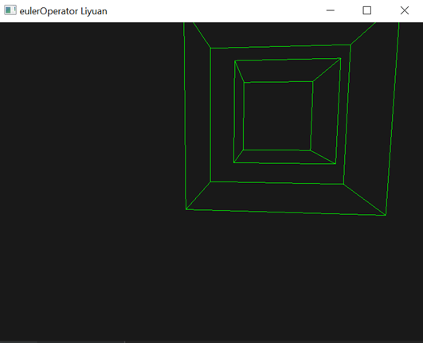
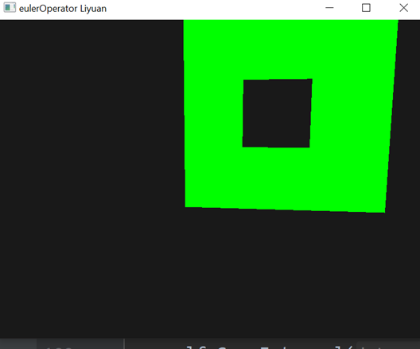
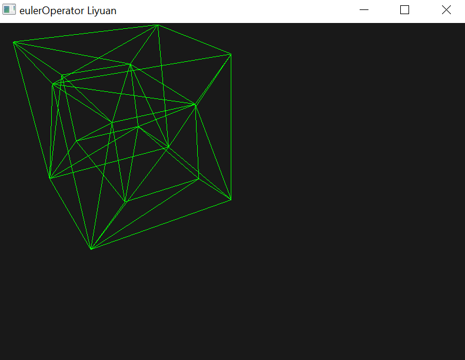
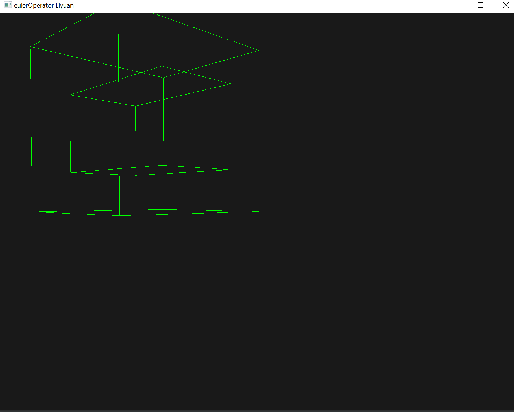

# Euler operation and rendering framework

## Euler-Poincaré formula

> The Euler-Poincaré formula describes the relationship between the number of vertices, the number of edges, and the number of manifolds and faces. It has been generalized to include potholes and holes penetrating solids. To illustrate the Euler-Poincaré formula, we need the following definitions:
> - V: number of vertices
> - E: number of edges
> - F: number of faces
> - G: Number of holes through solids, usually called classes in topology
> - S: Number of solid entities. The shell is the internal void of a solid. A shell is bounded by 2 manifold surfaces, which can have their own attribute values. Therefore, the value of S is at least 1.
> - L: Number of loops, counting all outer and inner loops of the face.
Then, the Euler-Poincaré formula is as follows: V-E + F-(L-F) = 2(S-G)

## Euler operation

Euler operations are mainly divided into the following five types
> - [x] MEV (for this project)
> - [x] MEF (for this project)
> - [x] MVFS (for this project)
> - [x] KFMLG (for this project)
> - [x] MEKL
> - [x] KEV
> - [x] KEF'
> - [x] KVFS
> - [x] MFKLG
> - [x] KEML (for this project)


This project probably uses and implements the Euler operation required above

> - [x] MEV: Create two half edges (one edge) and merge them with loop
> - [x] MEF: Divide a large ring into two oppositely oriented small rings by creating two half-edges, where the pointer of the original large ring still points to the outer small ring, and build a new one based on the inner small ring face.
> - [x] MVFS start of an entity
> - [x] KFMLG deletes a newly added face and uses the outer ring of this face as an inner ring of the retained face
> - [x] MEKL
> - [x] KEV
> - [x] KEF'
> - [x] KVFS
> - [x] MFKLG
> - [x] KEML removes an edge and constructs an inner ring.
>
The Euler operation is based on the matrix theory, which proves that it can cover all topological situations. At the same time, this design can ensure that the topology always satisfies the core of the 3-dimensional topology theory (Eulerian Poincaré equation).

## My implementation result
All third-party libraries are attached, and in the windows environment, you can directly git clone and run it.

## Show results
Press the L key to switch between two rendering modes, the basic Line mode and the entity mode.



## Encapsulation and use of rendering framework

In my code, render is an encapsulated rendering framework. If you want to call this framework in your Euler job, you must perform the following steps:
1. Add the header file
```C++
#include "render.h"
#include "callback.h"
```
2. Then configure the following code
```C++
     Render* render = new Render(is_show_line,
     &res, // Triangulated data
     &lines, // Basic wireframe data
     vs, fs,
     SCR_WIDTH,SCR_HEIGHT,
     processInput,
     framebuffer_size_callback,
     scroll_callback, mouse_callback);
     allrender = render;
     render->Init() ;
     render->MainLoop(camera) ;
     render->ShutDown(0) ;

     return 0;
```
All other parameters do not need to be changed, you only need to pass in your own res and lines.
res can be understood as the following data:

That is, the data generated by triangulating each face of a triangle.
lines can be understood as the following data:

Basic Wireframe Data

## Triangulation framework and use

The triangulation framework is poly2triangles in the external folder. Of course, you can visit another delaunay triangulation in my github. At present, this part of the triangulation framework is only suitable for converting into three-dimensional functions in the two dimensions of the largest span. face. If one x, y corresponds to multiple z values, then your surface cannot use this triangulation framework. Obviously, in this project, we are only using squares, so this algorithm is more than enough.


## If you have any questions, send an email to yuanli@zju.edu.cn or git issues.
Welcome to my personal website, http://www.crazyweirdo.xyz/.
Any hacking is shameful, this is just a knowledge sharing site for current students.
